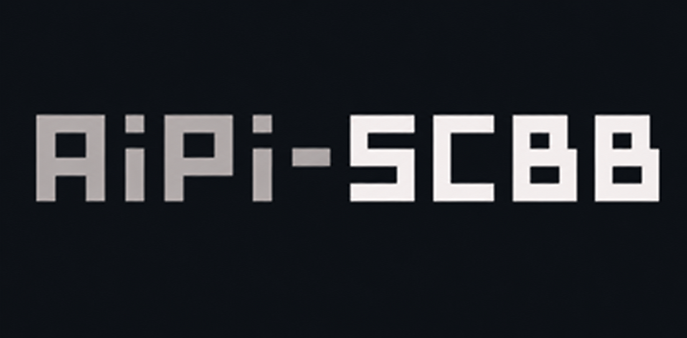
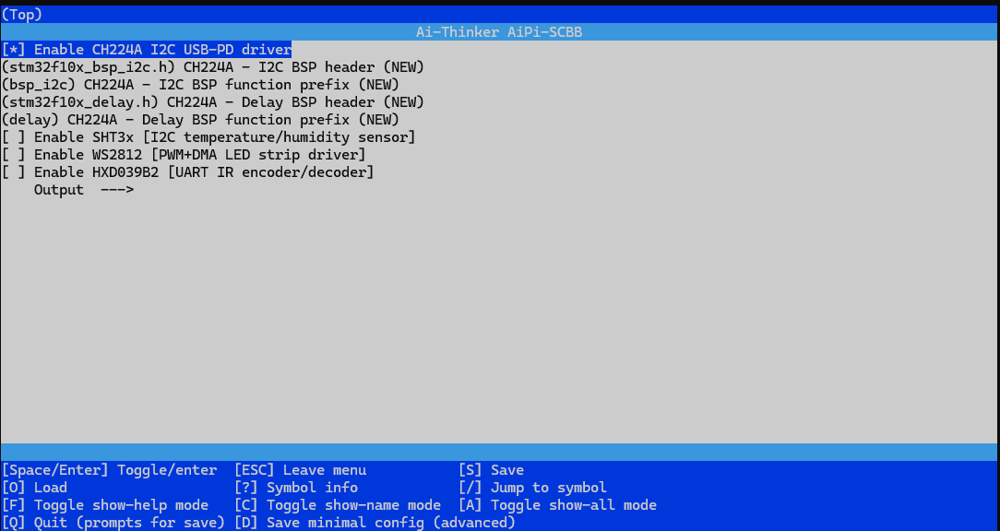
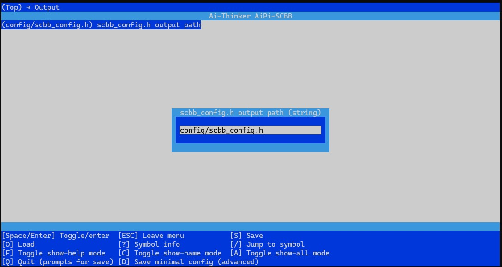

<p align="center">
  
</p>

[](README_zh.md)

Ai-Thinker STM32F10x peripheral driver library providing a unified hardware abstraction layer for I2C, PWM+DMA, and UART external components.

Built on STM32 HAL and FreeRTOS, designed for the AiPi development board series.

## Supported Modules

| Module | Description | Protocol | Address |
|--------|-------------|----------|---------|
| CH224A | USB-PD sink controller (voltage negotiation: 5-28V, PPS, AVS) | I2C | 0x22 |
| SHT3x | Temperature & humidity sensor | I2C | 0x44 |
| WS2812 | Addressable RGB LED strip driver + HSV/RGB color utilities | PWM+DMA | — |
| HXD039B2 | IR encoder/decoder (AC remote control) | UART+GPIO | — |

## Prerequisites

### Python Dependencies (required for menuconfig)

```bash
pip install kconfiglib windows-curses
```

### Build Tools

- CMake 3.15+
- GCC (ARM cross-compiler for STM32)

## Configuration

### Option 1: menuconfig.py (Recommended)

Run the graphical configuration tool:

```bash
python menuconfig.py
```



**Steps:**

1. Run the command to open the TUI configuration interface
2. Use `↑` `↓` arrow keys to select a module
3. Press `Y` to enable a module (marked as `[*]`)
4. Expand a module to configure BSP header and prefix (e.g. `stm32f10x_bsp_i2c.h`, `bsp_i2c`)


5. Enter `Output` menu to set `scbb_config.h` output path (default: `config/scbb_config.h`)



6. Press `S` to save, then `Q` to exit

The tool generates `scbb_config.h` automatically. CMake reads this file to determine which modules are enabled — no manual `-D` flags needed.

### Option 2: Manual Configuration

1. Copy `config/scbb_config.h` to your project root
2. Uncomment the modules you need:

```c
#define SCBB_CH224A_ENABLED 1   // Enable CH224A
#define SCBB_SHT3X_ENABLED 1    // Enable SHT3x
// #define SCBB_WS2812_ENABLED 1  // Uncomment to enable WS2812
// #define SCBB_HXD039B2_ENABLED 1 // Uncomment to enable HXD039B2
```

3. Rebuild your project

## Integration

### Option A: CMake add_subdirectory (Recommended)

Place AiPi-SCBB in your project directory, then in your `CMakeLists.txt`:

```cmake
add_subdirectory(AiPi-SCBB)

add_executable(your_app main.c)
target_link_libraries(your_app PRIVATE AiPi::SCBB)
```

### Option B: CMake FetchContent

```cmake
include(FetchContent)

FetchContent_Declare(
    aipi_scbb
    GIT_REPOSITORY https://github.com/Ai-Thinker-Open/AiPi-SCBB.git
    GIT_TAG        master
)
FetchContent_MakeAvailable(aipi_scbb)

add_executable(your_app main.c)
target_link_libraries(your_app PRIVATE AiPi::SCBB)
```

### Option C: Manual Source Inclusion

For non-CMake build systems (Keil, IAR, Makefile, etc.), add files manually:

1. Add the `.c` and `.h` files for your required modules:
   - `CH224A/axk_ch224.c` + `axk_ch224.h`
   - `SHT3x/axk_sht3x.c` + `axk_sht3x.h`
   - `WS2812/axk_ws2812.c` + `axk_ws2812.h` + `color_mode.c` + `color_mode.h`
   - `HXD039B2/axk_hxd039b2.c` + `axk_hxd039b2.h`

2. If `SCBB_USE_BSP` is enabled, also add the corresponding BSP source files from `STM32F10x_bsp/`

3. Ensure `scbb_config.h` is in your header search path

4. Provide the following external dependencies (not included in this repo):

| Dependency | Description |
|------------|-------------|
| `stm32f1xx_hal.h` | STM32 HAL library |
| `FreeRTOS.h` / `task.h` / `timers.h` | FreeRTOS RTOS |
| `log.h` | Logging macros (provided by host firmware) |
| `tim.h` | HAL timer handle (`htim1`, used for PWM+DMA) |

## Updating

```bash
git pull origin master
```

After updating, re-run `python menuconfig.py` if you need to regenerate the configuration.

## Directory Structure

```
AiPi-SCBB/
├── CH224A/           # USB-PD sink controller driver (I2C)
├── SHT3x/            # Temperature & humidity sensor driver (I2C)
├── WS2812/           # RGB LED strip driver (PWM+DMA)
├── HXD039B2/         # IR encoder/decoder driver (UART+GPIO)
├── STM32F10x_bsp/    # Board Support Package (I2C, PWM+DMA, UART, GPIO, delay)
├── config/           # scbb_config.h template
├── scripts/          # Config generation scripts
├── Kconfig           # menuconfig configuration definitions
├── menuconfig.py     # Graphical configuration tool entry point
├── CMakeLists.txt    # CMake build file
└── scbb_config.h     # Auto-generated by menuconfig (git ignored)
```

## License

[MIT License](LICENSE)
