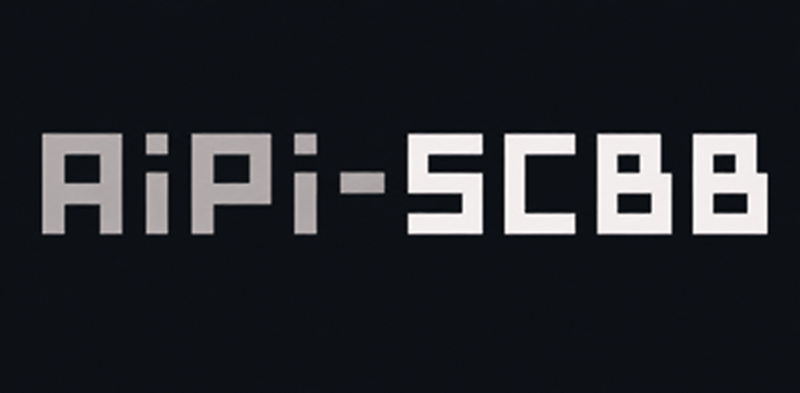
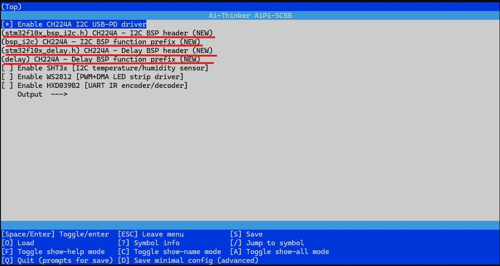
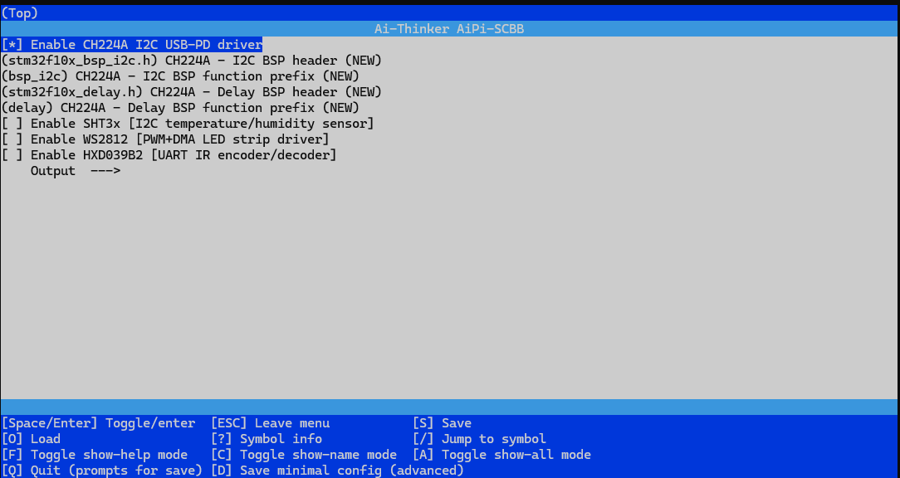
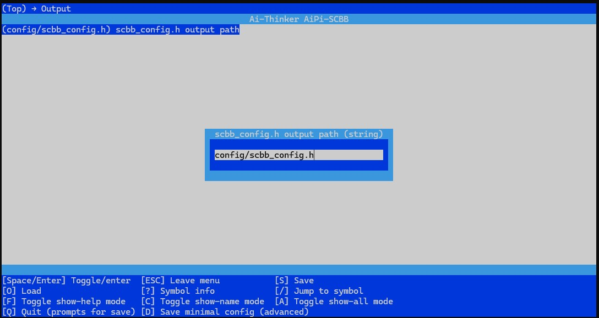

<p align="center">
  
</p>

[](README_zh.md)

Ai-Thinker general-purpose peripheral driver library providing a unified hardware abstraction layer for I2C, SPI, PWM+DMA, UART, GPIO, and One-Wire external components.

Platform-agnostic by design — the library uses configurable BSP (Board Support Package) macros, allowing you to port it to any MCU platform by providing your own BSP implementations.

Built-in BSPs: `BSP/Ai-M6x` (BL616/BL618, Bouffalo SDK) and `BSP/stm32f10x` (STM32 HAL).

## Supported Modules

| Module | Description | Protocol | Address |
|--------|-------------|----------|---------|
| CH224A | USB-PD sink controller (voltage negotiation: 5-28V, PPS, AVS) | I2C | 0x22 |
| SHT3x | Temperature & humidity sensor | I2C | 0x44 |
| WS2812 | Addressable RGB LED strip driver + HSV/RGB color utilities | PWM+DMA | — |
| HXD039B2 | IR encoder/decoder (AC remote control) | UART+GPIO | — |
| ST7789V_LCD | ST7789V SPI LCD driver (1.47", 1.69", 1.9", 2.0") | SPI+GPIO | — |
| RELAY | Relay driver (high-level active) | GPIO | — |
| DHT11 | Temperature & humidity sensor (One-Wire) | GPIO | — |
| RD03_V2 | mmWave radar presence & distance sensor | UART | — |
| INA226 | Voltage/current/power monitor | I2C | 0x40 |
| DS1302 | RTC real-time clock (3-wire bit-bang) | GPIO | — |
| OLED_096_SPI | 0.96" OLED display (SSD1306, 128x64) | SPI+GPIO | — |

## Prerequisites

### Python Dependencies (required for menuconfig)

```bash
pip install kconfiglib windows-curses
```

### Build Tools

- CMake 3.15+
- GCC (or any C compiler for your target platform)

## Configuration

### Option 1: menuconfig.py (Recommended)

Run the graphical configuration tool:

```bash
python menuconfig.py
```

<p align="center">
  
</p>

**Steps:**

1. Run the command to open the TUI configuration interface
2. Use `↑` `↓` arrow keys to select a module
3. Press `Y` to enable a module (marked as `[*]`)
4. Expand a module to configure BSP header and prefix (e.g. `my_platform_i2c.h`, `my_i2c`)

<p align="center">
  
</p>

5. Enter `Output` menu to set `scbb_config.h` output path (default: `scbb_config.h` in the project root)

<p align="center">
  
</p>

6. Press `S` to save, then `Q` to exit

The tool generates `scbb_config.h` automatically. CMake reads this file to determine which modules are enabled — no manual `-D` flags needed.

### Option 2: Manual Configuration

1. Create `scbb_config.h` in your project root (or run `python menuconfig.py` to generate it)
2. Uncomment or add the modules you need:

```c
#define SCBB_CH224A_ENABLED 1   // Enable CH224A
#define SCBB_SHT3X_ENABLED 1    // Enable SHT3x
// #define SCBB_WS2812_ENABLED 1  // Uncomment to enable WS2812
// #define SCBB_HXD039B2_ENABLED 1 // Uncomment to enable HXD039B2
// #define SCBB_ST7789V_LCD_ENABLED 1 // Uncomment to enable ST7789V_LCD
// #define SCBB_RELAY_ENABLED 1       // Uncomment to enable RELAY
// #define SCBB_DHT11_ENABLED 1       // Uncomment to enable DHT11
// #define SCBB_RD03_V2_ENABLED 1     // Uncomment to enable RD03_V2
// #define SCBB_INA226_ENABLED 1      // Uncomment to enable INA226
// #define SCBB_DS1302_ENABLED 1      // Uncomment to enable DS1302
// #define SCBB_OLED_096_SPI_ENABLED 1 // Uncomment to enable OLED_096_SPI
```

3. Rebuild your project

### About `scbb_config.h`

`scbb_config.h` is the core configuration file of this project. It controls:

- **Which modules are compiled** — `#define SCBB_<MODULE>_ENABLED 1` enables a module
- **BSP abstraction macros** — ACLL macros that map module calls to your hardware (e.g. `AXK_CH224A_I2C_ACLL` → `bsp_i2c_init()`)
- **BSP header and prefix configuration** — which header file and function prefix each module uses

This file is **auto-generated by menuconfig.py** and **read by CMake** at configure time. All module headers (`axk_ch224.h`, `axk_sht3x.h`, etc.) include `scbb_config.h` to get their BSP configuration.

> **Do not edit `scbb_config.h` manually** — re-run `python menuconfig.py` to regenerate it. If you need custom configuration, edit the options in menuconfig or use the manual method above.

## Integration

### Option A: CMake add_subdirectory (Recommended)

Place AiPi-SCBB in your project directory, then in your `CMakeLists.txt`:

```cmake
add_subdirectory(AiPi-SCBB)

add_executable(your_app main.c)
target_link_libraries(your_app PRIVATE AiPi::SCBB)
```

### Option B: CMake FetchContent

```cmake
include(FetchContent)

FetchContent_Declare(
    aipi_scbb
    GIT_REPOSITORY https://github.com/Ai-Thinker-Open/AiPi-SCBB.git
    GIT_TAG        master
)
FetchContent_MakeAvailable(aipi_scbb)

add_executable(your_app main.c)
target_link_libraries(your_app PRIVATE AiPi::SCBB)
```

### Option C: Manual Source Inclusion

For non-CMake build systems (Keil, IAR, Makefile, etc.), add files manually:

1. Add the `.c` and `.h` files for your required modules:
   - `CH224A/axk_ch224.c` + `axk_ch224.h`
   - `SHT3x/axk_sht3x.c` + `axk_sht3x.h`
   - `WS2812/axk_ws2812.c` + `axk_ws2812.h` + `color_mode.c` + `color_mode.h`
   - `HXD039B2/axk_hxd039b2.c` + `axk_hxd039b2.h`
   - `ST7789V_LCD/axk_st7789v_lcd.c` + `axk_st7789v_lcd.h`
   - `RELAY/axk_relay.c` + `axk_relay.h`
   - `DHT11/axk_dht11.c` + `axk_dht11.h`
   - `RD03_V2/axk_rd03_v2.c` + `axk_rd03_v2.h`
   - `INA226/axk_ina226.c` + `axk_ina226.h`
   - `DS1302/axk_ds1302.c` + `axk_ds1302.h`
   - `OLED_096_SPI/axk_oled_096_spi.c` + `axk_oled_096_spi.h`

2. If `SCBB_USE_BSP` is enabled, also add the corresponding BSP source files from `BSP/Ai-M6x/` (Bouffalo BL616/BL618) or `BSP/stm32f10x/` (STM32F10x)

3. Ensure `scbb_config.h` is in your header search path

4. Provide the following external dependencies (not included in this repo):

| Dependency | Description |
|------------|-------------|
| `log.h` | Logging macros (provided by your firmware) |
| `FreeRTOS.h` / `task.h` / `timers.h` | FreeRTOS RTOS (optional, used by some modules) |

## Updating

```bash
git pull origin master
```

After updating, re-run `python menuconfig.py` if you need to regenerate the configuration.

## Directory Structure

```
AiPi-SCBB/
├── CH224A/           # USB-PD sink controller driver (I2C)
├── SHT3x/            # Temperature & humidity sensor driver (I2C)
├── INA226/           # Voltage/current/power monitor driver (I2C)
├── WS2812/           # RGB LED strip driver (PWM+DMA)
├── HXD039B2/         # IR encoder/decoder driver (UART+GPIO)
├── DHT11/            # Temperature & humidity sensor driver (One-Wire)
├── DS1302/           # RTC real-time clock driver (3-wire GPIO)
├── RELAY/            # Relay driver (GPIO)
├── RD03_V2/          # mmWave radar driver (UART)
├── OLED_096_SPI/     # 0.96" OLED display driver (SPI)
├── ST7789V_LCD/      # ST7789V LCD driver (SPI)
├── BSP/              # Board Support Packages
│   ├── Ai-M6x/       # Bouffalo BL616/BL618 BSP (I2C, SPI, UART, GPIO, LCD, delay)
│   └── stm32f10x/    # STM32F10x BSP (I2C, SPI, UART, GPIO, PWM+DMA, delay)
├── scripts/          # Config generation scripts
├── Kconfig           # menuconfig configuration definitions
├── menuconfig.py     # Graphical configuration tool entry point
├── CMakeLists.txt    # CMake build file
└── scbb_config.h     # Auto-generated by menuconfig (git ignored)
```

## License

[MIT License](LICENSE)
